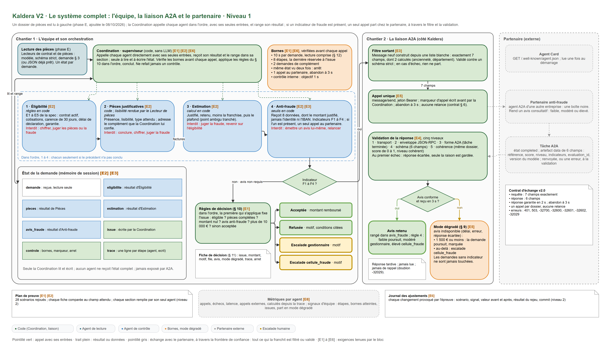
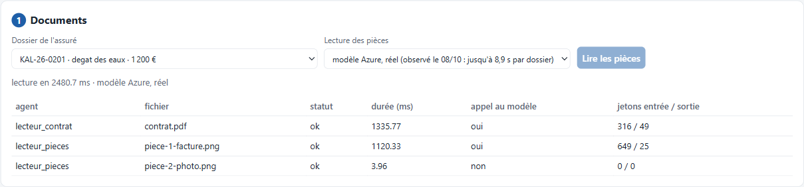
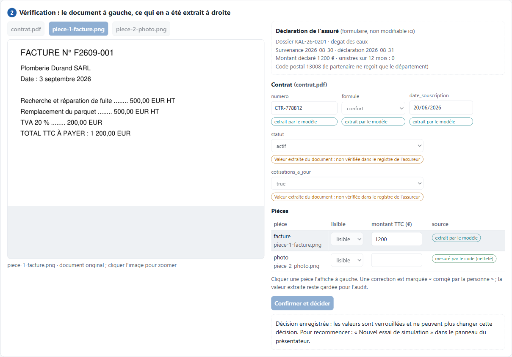
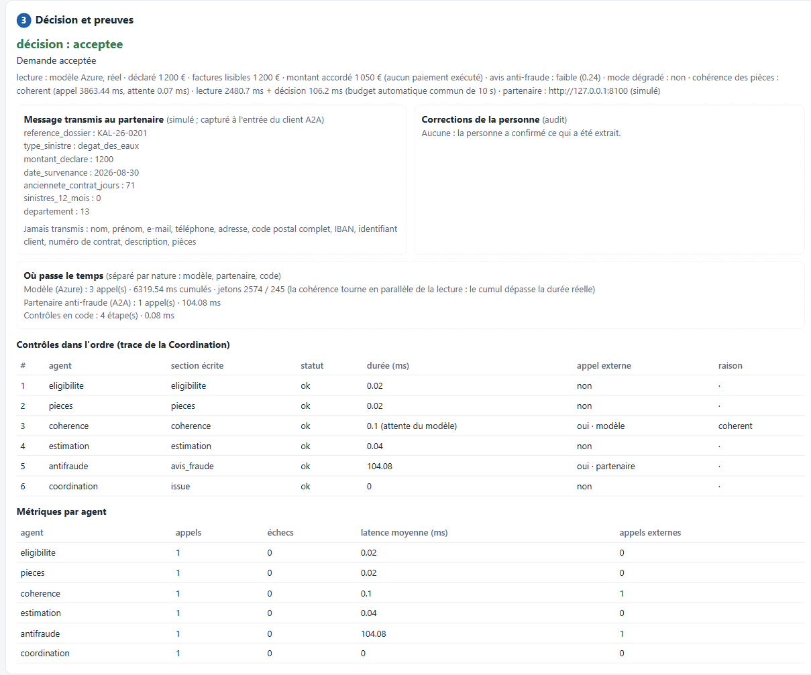
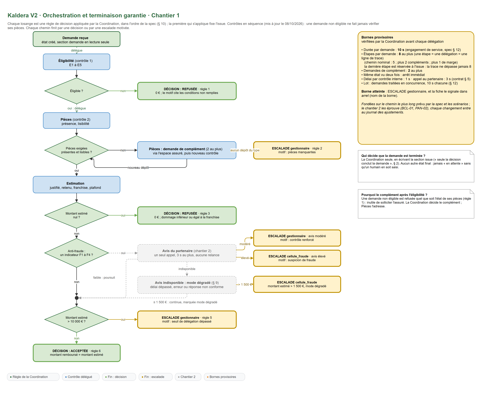
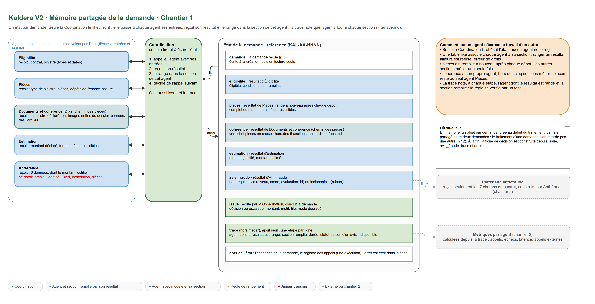
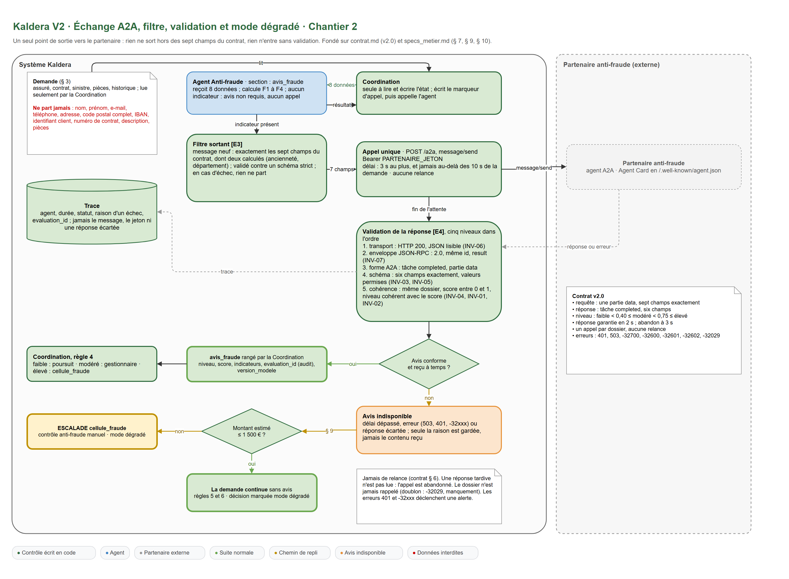
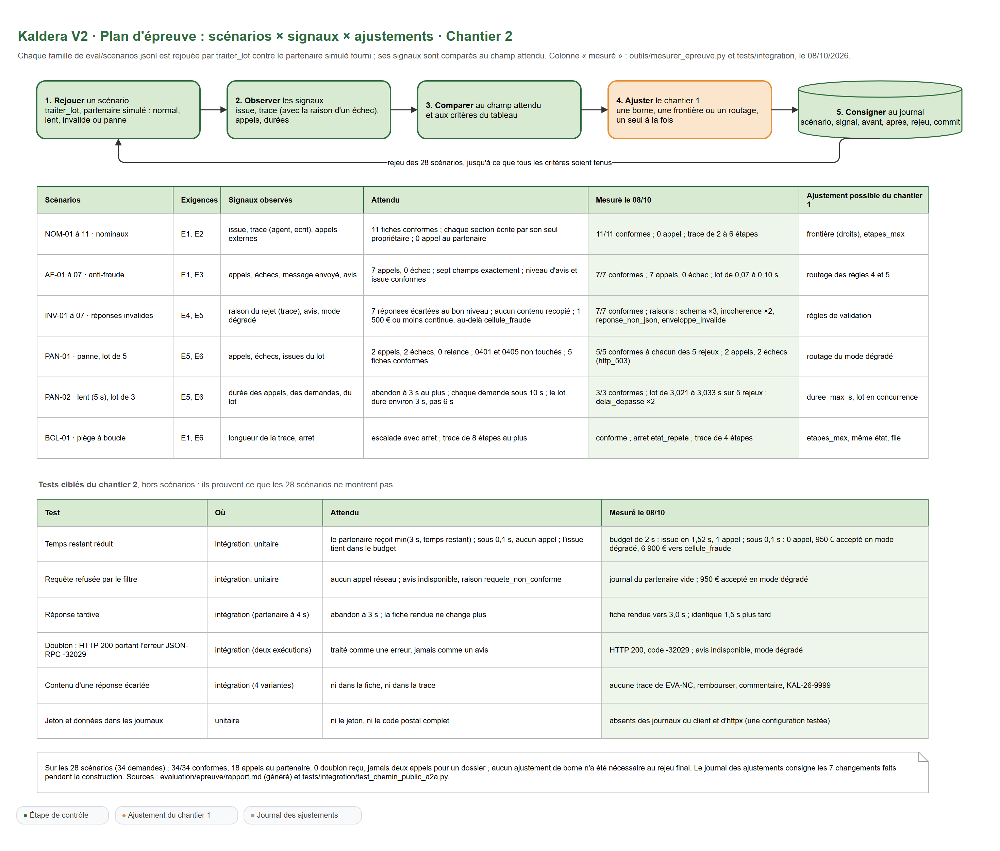

# Kaldera V2 : dossier de conception

> Équipe d'agents de traitement des demandes de remboursement habitation, et collaboration A2A avec le partenaire anti-fraude

## 1. Le besoin du client et les choix qui en découlent

### 1.1 Le problème

Kaldera traite aujourd'hui ses demandes de remboursement avec un agent généraliste unique. Quand le partenaire anti-fraude ne répond pas, la demande reste bloquée, parfois pendant des semaines. Le partenaire vient en outre de durcir son contrat (version 2.0) : sept champs exactement, aucune donnée personnelle, un seul appel par dossier, aucune relance, réponse garantie en 2 s.

La direction des opérations fixe six exigences, toutes absolues :

| # | Exigence |
|---|---|
| [E1] | Toute demande se termine par une décision ou une escalade humaine motivée, jamais par un blocage silencieux |
| [E2] | Chaque agent a un rôle et une frontière définis ; aucun agent n'empiète sur le rôle d'un autre |
| [E3] | Seules les données prévues au contrat partent chez le partenaire |
| [E4] | Une réponse du partenaire non conforme au contrat est rejetée, jamais propagée |
| [E5] | Partenaire indisponible : le mode dégradé défini par le métier s'applique |
| [E6] | Aucune boucle infinie ; métriques visibles par agent ; tout ajustement de l'orchestration consigné |

La spécification nomme aussi E1 à E5 les cinq conditions d'éligibilité (§ 4). Dans ce dossier, les exigences de la direction sont toujours entre crochets : [E1] à [E6].

### 1.2 Trois choix structurants

**Un modèle là où il faut interpréter un document, du code pour décider.** Les règles de décision sont chiffrées (spécification, § 4 à § 10) : dates, seuils, franchises, plafonds. Elles s'écrivent en code et se testent. Un modèle n'intervient qu'à trois endroits, tous sur des documents : la lecture du contrat en PDF, la lecture des factures en photo, et la cohérence des pièces avec la déclaration (§ 5). Chaque usage a un format de sortie strict, une règle d'échec écrite et une mesure (section 2.5). L'avis de fraude est rendu par le partenaire, « jamais en interne » (§ 2). Aucune règle chiffrée n'est confiée à un modèle : il ne conclut jamais une demande.

**Un superviseur en code et quatre agents de contrôle.** `interface.md` impose qu'une section métier ne soit écrite que par un agent, et qu'un agent n'écrive qu'une section. Les sections étant cinq (`eligibilite`, `pieces`, `estimation`, `avis_fraude`, `issue`), il y a cinq écrivains : la Coordination, qui conclut, et quatre contrôles déterministes. L'équipe compte huit rôles internes : trois qui utilisent un modèle (lecteur de contrat, lecteur de pièces, agent Documents et cohérence), quatre contrôles déterministes (Éligibilité, Pièces, Estimation, Anti-fraude) et la Coordination, qui applique les règles et produit seule l'issue. L'agent Documents et cohérence écrit une section de travail, `coherence`, hors des cinq sections métier : `pieces` garde un seul propriétaire. Le partenaire anti-fraude est un agent externe : il appartient à une autre entreprise.

**La mémoire de la demande n'appartient qu'à la Coordination.** Elle seule lit et écrit l'état. Elle appelle chaque agent directement, lui passe seulement les données utiles et range son résultat. Un agent ne peut donc ni écraser le travail d'un autre, ni envoyer au partenaire une donnée qu'il n'a jamais reçue.

### 1.3 Ce que la conception écarte, et pourquoi

| Écarté | Raison |
|---|---|
| Un framework d'orchestration d'agents | le parcours est fixé par la spécification ; une boucle en code, courte et déterministe, suffit à garantir les bornes |
| Un planificateur LLM qui choisit les étapes | les étapes et leur ordre sont connus d'avance (§ 2) |
| Un disjoncteur sur le partenaire | un seul appel par dossier ; une panne coûte au plus 3 s à la demande concernée, sans toucher les autres |
| Un tableau de bord dédié | les métriques sont calculées depuis la trace et rendues par `traiter_lot` ; un rapport de rejeu suffit pour l'épreuve |
| Un LLM pour rédiger le motif | des modèles de phrases suffisent ; un LLM ne pourrait l'écrire qu'hors décision, à partir de champs validés |

## 2. La carte des agents

### 2.1 Rôles et frontières

| Agent | Rôle | Reçoit de la Coordination | Renvoie | Ne fait jamais |
|---|---|---|---|---|
| Coordination | délègue, vérifie les bornes, range les résultats, applique les règles du § 10, conclut | l'état complet, qu'elle est seule à lire | la section `issue` et la fiche de décision | refaire un contrôle |
| Éligibilité | conditions E1 à E5 de la spécification | contrat, type et dates du sinistre | éligible ou non, conditions non remplies | chiffrer, appliquer le plafond, juger les pièces ou la fraude |
| Pièces | présence, lisibilité et type des pièces ; demande de complément quand la Coordination la lui confie | type de sinistre, pièces, dépôts de l'espace assuré | complet ou pièces manquantes, factures lisibles | conclure, escalader, décider seul d'un complément |
| Documents et cohérence | concordance des pièces lisibles avec la déclaration (§ 5), après un contrôle des pièces complet | le sinistre déclaré et les images nettes | cohérent, contradiction (pièce citée), insuffisant, ou non effectué | lire les montants, juger la fraude, conclure |
| Estimation | montant justifié, montant retenu, franchise, plafond | montant déclaré, formule, factures lisibles | les montants | juger la fraude, revenir sur l'éligibilité |
| Anti-fraude | indicateurs F1 à F4, un appel au partenaire, contrôle de la réponse | huit données, sans identité ni IBAN | avis non requis, avis du partenaire, ou indisponible avec la raison | émettre un avis lui-même, envoyer une donnée hors contrat, relancer un appel |

Dans la trace et les métriques, les agents portent des noms fixes : `coordination`, `eligibilite`, `pieces`, `coherence`, `estimation`, `antifraude`. Chaque agent a ses propres outils : seul l'agent Anti-fraude détient le client du partenaire et le jeton d'accès ; seul l'agent Pièces peut écrire à l'espace assuré.

### 2.2 Le point ambigu : le plafond de garantie

La spécification range le plafond dans la section éligibilité (§ 4), mais précise que « le contrôle d'éligibilité ne chiffre pas la demande » (§ 2), et la section estimation (§ 6) ne le cite pas. **Choix : l'Estimation applique le plafond**, parce que c'est un calcul de montant. Le scénario NOM-05 le confirme : 4 200 € déclarés, moins 300 € de franchise, soit 3 900 €, plafonnés à 3 000 € remboursés. Une demande au-dessus du plafond n'est donc jamais refusée : elle est payée au plafond.

Autres frontières tranchées :

| Responsabilité | Revendiquée par | Choix |
|---|---|---|
| Escalader pour pièces manquantes | Pièces, Coordination | Pièces le constate, la Coordination escalade : « seule la décision conclut la demande » (§ 2) |
| Un montant déclaré supérieur aux factures | Pièces, Anti-fraude | Anti-fraude, par l'indicateur F4 ; ce n'est pas un motif de complément (scénario AF-06 : 2 000 € déclarés, 1 500 € justifiés, demande acceptée) |
| Décider d'une demande de complément | Pièces, Coordination | la Coordination, après le résultat de l'Éligibilité ; Pièces l'adresse à l'assuré |

### 2.3 Dépendances et parallélisme

- Éligibilité, puis Pièces, **en séquence** : une demande non éligible est refusée sans contrôle des pièces (0,01 ms par contrôle, le parallèle n'apportait rien).
- La demande de complément attend l'Éligibilité : on ne sollicite pas l'assuré pour une demande qui sera refusée.
- L'Estimation attend les factures lisibles de Pièces.
- L'Anti-fraude attend l'Estimation, car F4 compare le montant déclaré au montant justifié. Appeler le partenaire plus tôt gaspillerait l'unique appel autorisé.
- La Coordination conclut en dernier.

Quand deux résultats se contredisent (éligible, mais pièces incomplètes), l'ordre des règles du § 10 tranche : la première qui s'applique fixe l'issue.

### 2.4 Pourquoi des agents, si les contrôles sont des règles

Un agent est ici une unité de responsabilité : un rôle, un contrat d'entrée et de sortie, une section de la mémoire, un nom dans la trace et ses métriques. Sa réalisation interne peut être du code ou un LLM ; la Coordination ne voit que le contrat. Trois bénéfices : un changement de règle (une carence de 30 à 45 jours) ne touche qu'un agent ; la frontière se prouve dans la trace ; la lecture des documents par un modèle a été ajoutée en amont, sans que la Coordination ni la mémoire changent.

### 2.5 Où un modèle est utilisé, et pourquoi

Règle de conception : un modèle n'intervient que là où il faut interpréter un document, avec un format de sortie strict, une règle d'échec écrite et une mesure. Partout où la spécification donne une règle chiffrée (§ 4 à § 10), le traitement est en code. Le modèle est gpt-5.4 (Azure AI Foundry), utilisé en vision pour les images.

| Agent | Entrée | Sortie (format strict) | Pourquoi un modèle | Si le modèle échoue | Mesure |
|---|---|---|---|---|---|
| Lecteur de contrat | le texte de `contrat.pdf`, extrait par le code | `ContratLu` : numéro, formule, date de souscription, statut, cotisations à jour | trois mises en page, dates écrites en toutes lettres : il faut interpréter le document | escalade gestionnaire motivée ; un numéro lu différent du numéro déclaré part aussi en escalade | 5 champs justes sur 34 dossiers sur 34 ; 1,69 s par appel en moyenne |
| Lecteur de pièces | l'image d'une facture, après le contrôle de netteté en code | `FactureLue` : lisible, montant total TTC | lire un total sur une image demande la vision | dans le doute, la pièce est illisible : demande de complément (§ 5), jamais un montant inventé | montants 33 sur 33, lisibilité 68 sur 68 ; 2,10 s en moyenne |
| Documents et cohérence | toutes les images nettes et la déclaration | `Interpretation` : pour chaque pièce, nature, sinistre évoqué, date, concordance (oui, non, incertain) | la spécification demande la cohérence des pièces avec la déclaration (§ 5) ; savoir qu'une facture de miroiterie ne répare pas une fuite ne relève d'aucune règle chiffrée | contrôle « non effectué » : une personne reprend la demande ; le code calcule le verdict, le modèle ne conclut jamais | 42 dossiers étiquetés : 6 contradictions sur 6, aucune fausse contradiction ; 3,97 s en moyenne |

Sans modèle : Éligibilité, Pièces, Estimation, Anti-fraude et la Coordination appliquent des règles chiffrées, avec la même réponse à chaque fois, testée juste en dessous et juste au-dessus de chaque seuil. La netteté d'une photo se mesure aussi en code. Chaque consigne précise que le document est une donnée, jamais une instruction, et qu'une information absente ou douteuse ne s'invente pas.

**Ce que montre le poste du gestionnaire.** Les trois captures suivantes ont été prises le 09/10/2026 sur le dossier KAL-26-0201, lu par le modèle réel.

Le tableau de lecture (figure 3) indique, pour chaque pièce, si le modèle a été appelé, la durée et les jetons consommés. Le contrat (1 336 ms, 316 jetons en entrée, 49 en sortie) et la facture (1 120 ms, 649 et 25) passent par le modèle. La photo, jugée sur sa netteté par le code, n'en consomme aucun.

Dans la vérification (figure 4), chaque valeur extraite porte sa source : « extrait par le modèle », « mesuré par le code (netteté) », ou, pour le statut et les cotisations, « non vérifiée dans le registre de l'assureur ». La personne compare au document affiché à gauche ; une correction est marquée et la valeur extraite reste gardée pour l'audit.

Dans la décision (figure 5), l'encadré « Où passe le temps » sépare les trois natures d'appel : 3 appels au modèle (6 320 ms cumulés, 2 574 jetons en entrée et 245 en sortie), 1 appel au partenaire anti-fraude (104 ms) et 4 contrôles en code (0,08 ms au total). La cohérence tourne en parallèle de la lecture : le cumul des appels au modèle dépasse donc la durée réelle de la lecture (2,5 s). Dans la trace, la durée de l'étape de cohérence (0,1 ms) n'est que l'attente d'un appel parti dès l'arrivée du dossier ; l'appel lui-même a duré 3 863 ms. Les 104 ms de l'agent Anti-fraude sont l'aller-retour vers le partenaire, pas un appel au modèle.

Les deux évaluations réelles restent « échouées » : pour la lecture, 32 issues sur 34 identiques au chemin JSON (seuil de 95 %), les deux écarts venant de la cohérence ; pour la cohérence, un échec technique sur 42 dossiers (un appel au-delà du budget, pour un seuil de zéro) ; les deux examens inutiles restent sous leur seuil de trois. Les documents sont générés à partir des 34 demandes : la mesure ne porte pas sur de vrais scans. Rapports : `evaluation/extraction/rapport.md` et `evaluation/coherence/rapport.md`.

## 3. L'orchestration et la mémoire partagée

### 3.1 Le schéma d'orchestration

Le schéma est un **superviseur en séquence** : la Coordination délègue chaque contrôle dans l'ordre de la spécification, et s'arrête dès qu'une règle conclut. Les agents ne s'appellent jamais entre eux et ne choisissent pas l'étape suivante. Une étape est une délégation : l'appel, le résultat, son rangement, soit une ligne de trace.

**Qui décide qu'une demande est terminée : la Coordination seule**, en écrivant la section `issue`. Avant tout contrôle, une déclaration datée avant la survenance du sinistre part en escalade `gestionnaire` : la spécification ne prévoit pas ce cas, aucune règle n'est inventée (journal, entrée 9). Ensuite, la Coordination applique les règles du § 10 dans l'ordre :

| Règle | Condition | Issue |
|---|---|---|
| 1 | demande non éligible | refusée, 0 € |
| 2 | pièces manquantes | escalade `gestionnaire` |
| 2 bis | chemin des pièces : pièces incohérentes avec la déclaration, cohérence incertaine, ou contrôle de cohérence impossible (§ 5) | escalade `gestionnaire`, avec trois motifs distincts et la pièce citée |
| 3 | montant estimé nul (dommage inférieur ou égal à la franchise) | refusée, 0 € |
| 4 | contrôle anti-fraude requis | `modere` : escalade `gestionnaire` ; `eleve` : escalade `cellule_fraude` ; indisponible : mode dégradé ; `faible` : la demande poursuit |
| 5 | montant estimé supérieur à 10 000 € | escalade `gestionnaire` |
| 6 | sinon | acceptée, montant estimé remboursé |

**L'étape de cohérence.** Elle n'existe que sur le chemin des pièces : une demande JSON ne porte que le type et le montant de chaque pièce. La Coordination la délègue après un contrôle des pièces complet, pour qu'une pièce manquante suive d'abord la demande de complément, et avant l'Estimation. Le refus d'éligibilité reste prioritaire. L'appel au modèle part dès l'arrivée du dossier, en parallèle de la lecture du contrat et des factures, car l'interprétation ne dépend que du formulaire et des images (journal, entrée 12) : la Coordination n'attend que son résultat, sur le même budget. Aucun verdict de cohérence n'est une décision : contradiction, doute et échec technique vont à une personne. Un appel parti mais inutile, parce que la demande s'est conclue avant, reste noté avec son coût : 8 dossiers sur 42 dans l'évaluation.

Il n'existe que deux issues : une décision (acceptée ou refusée) ou une escalade motivée, avec sa file et un motif lisible. Aucun état « en attente » sans qu'un humain en soit saisi. Un agent interne en échec n'est pas relancé (relancer du code déterministe redonnerait la même erreur) : escalade `gestionnaire`, motif « erreur interne », échec compté dans les métriques.

Les lots sont traités **en concurrence**, chaque demande avec son propre état et sa propre durée : « le traitement d'une demande n'est jamais retardé par celui d'une autre » (§ 12).

### 3.2 Les bornes

Les valeurs imposées par la spécification ou le contrat ne se discutent pas. Deux autres sont tirées de la mesure, par une règle écrite dans `bornes.py` ; les dernières sont des valeurs de départ, éprouvées par le plan d'épreuve (section 5).

| Borne | Valeur | Base du choix | Scénario qui l'éprouve |
|---|---|---|---|
| Durée par demande (`duree_max_s`) | 10 s | engagement de service (§ 12). Le budget commence à l'arrivée du dossier et couvre la lecture des pièces ; chaque appel au modèle et au partenaire reçoit le temps restant ; la Coordination continue la même limite (journal, entrée 5) | PAN-02 |
| Réserve de la fiche (`reserve_fiche_s`) | 0,4 s | tirée de la mesure : dix fois le plus grand dépassement mesuré après l'échéance (38 ms sur 70 essais), arrondi au dixième supérieur (journal, entrée 8) | `evaluation/bornes/rapport.md` |
| Étapes par demande (`etapes_max`) | 8 | chemin nominal de 5 étapes, plus 2 compléments, plus 1 de marge ; sur le chemin des pièces, la cohérence ajoute une étape : 8 au plus, la borne tient sans marge. La dernière étape est réservée à l'issue | BCL-01 |
| Demandes de complément | 2 | NOM-07 et PAN-01 en demandent une ; aucun scénario n'en justifie davantage | BCL-01 |
| Même état vu deux fois | arrêt immédiat | un dépôt aussi illisible que la pièce d'origine ne fait pas avancer la demande | BCL-01 |
| Appels au partenaire par dossier | 1 | contrat, § 6 | PAN-01, PAN-02, INV |
| Délai d'un appel au partenaire | 3 s, ou le temps restant s'il est plus court | contrat, § 5 ; un seul budget pour toute la demande (journal, entrée 7) | PAN-02 |
| Délai minimal d'un appel au partenaire (`delai_partenaire_min_s`) | 0,15 s | tiré de la mesure : l'appel réussi le plus long (0,10 s sur 65 essais), arrondi au vingtième supérieur ; en dessous, aucun appel, pour ne pas gâcher le seul permis (journal, entrée 8) | `evaluation/bornes/rapport.md` |
| Délai par contrôle interne | objectif 1 s, non imposé | contrôles en code, sans réseau, mesurés à 0,01 ms ; la limite de 10 s est vérifiée avant chaque étape | nominaux |

Une borne atteinte ne produit jamais un arrêt silencieux : la demande est escaladée vers `gestionnaire` et sa fiche le signale dans `arret`, avec le nom de la borne. Le scénario BCL-01 l'illustre : facture illisible, puis un seul dépôt tout aussi illisible. La borne « même état vu deux fois » arrête la demande à la quatrième étape (éligibilité, pièces, complément, issue).

### 3.3 La mémoire partagée de la demande

**Ce qu'elle contient.** La demande reçue, en lecture seule ; les cinq sections métier ; sur le chemin des pièces, la section de travail `coherence` ; la trace, en ajout seul. Hors de l'état : l'échéance de la demande et le registre des appels (une exécution) ; `arret` est écrit dans la fiche.

**Où elle vit.** En mémoire, un objet par demande, créé au début du traitement et jamais partagé entre deux demandes. La fiche de décision est construite à partir de cet état à la fin du traitement.

**Accès maîtrisé.** Seule la Coordination lit et écrit l'état. Une table fixe associe chaque agent à sa section ; la Coordination range le résultat d'un agent dans cette seule section et refuse tout autre rangement (erreur de droits). `pieces` est remplie à nouveau après chaque dépôt de l'assuré ; les autres sections ne le sont qu'une fois. Les contrôles tournent en séquence. Seul l'appel au modèle de la cohérence tourne en parallèle de la lecture, et son résultat n'est rangé que par la Coordination : un seul composant écrit, aucun conflit possible. La section `coherence` est hors des cinq sections métier d'`interface.md` : `pieces` garde un seul propriétaire.

| Section | Remplie par le résultat de | Contenu passé ensuite à |
|---|---|---|
| `eligibilite` | Éligibilité | Coordination (règle 1) |
| `pieces` | Pièces, après chaque dépôt | Estimation (factures lisibles), Coordination (règle 2) |
| `coherence` | Documents et cohérence, chemin des pièces | Coordination (règle 2 bis) |
| `estimation` | Estimation | Anti-fraude (montant justifié), Coordination (règles 3 et 5) |
| `avis_fraude` | Anti-fraude | Coordination (règle 4) |
| `issue` | Coordination | fiche de décision |
| `trace` | une ligne par étape, au nom de l'agent dont le résultat est rangé | métriques, fiche de décision |

**Mémoire de session et informations exposées.** L'état de la demande est une mémoire de session, interne à la plateforme et jamais exposée. `interface.md` fixe autre chose : ce que la plateforme expose au système d'information (fiche, trace, métriques). Le partenaire, lui, ne voit que les sept champs de son contrat : la mémoire d'un agent n'est jamais exposée par A2A.

**Reprise après incident.** Une demande se traite en 10 s au plus : en cas de crash, elle est reprise depuis le début, les contrôles en code donnant le même résultat. **Une exception, imposée par le contrat du partenaire** : un seul appel par dossier, et un doublon est signalé comme manquement. La Coordination réserve donc la référence dans le registre des appels avant l'envoi : dans une même exécution (une demande ou un lot), un second appel est bloqué et l'avis est « indisponible ». **Limite écrite** (journal, entrées 2 et 3) : après un redémarrage, le registre est vide et la protection n'est pas assurée ; si le partenaire a déjà évalué le dossier, il répond -32029, traité comme une erreur (avis indisponible, mode dégradé). Une protection durable demanderait un stockage persistant.

## 4. L'échange A2A et le mode dégradé

### 4.1 Le contrat du partenaire

| Rubrique | Contrat version 2.0 |
|---|---|
| Appel | `POST /a2a`, JSON-RPC 2.0, méthode `message/send`, jeton `Authorization: Bearer` |
| Requête | une seule partie `data`, avec exactement sept champs ; tout autre champ est refusé |
| Réponse | une tâche `completed` portant six champs : `reference_dossier`, `score`, `niveau`, `indicateurs`, `evaluation_id`, `version_modele` |
| Cohérence | `faible` si score < 0,40 ; `modere` de 0,40 à 0,75 exclu ; `eleve` à partir de 0,75 |
| Délais | réponse garantie en 2 s ; le client abandonne au plus tard à 3 s |
| Limites | un seul appel par dossier ; aucune relance, ni après un délai, ni après une erreur, ni après une réponse écartée |

L'appel n'a lieu que si l'un des quatre indicateurs est présent : F1, montant déclaré d'au moins 5 000 € ; F2, contrat de moins de 90 jours ; F3, au moins 3 sinistres sur 12 mois ; F4, montant déclaré supérieur de plus de 20 % au montant justifié. Le format suit la version 0.3.0 du protocole A2A (`message/send`, parties typées par `kind`).

### 4.2 Le filtre des données sortantes [E3]

Le filtre s'applique dans l'agent Anti-fraude, juste avant l'appel : c'est le seul point de sortie vers le partenaire. [E3] est tenu deux fois. À l'entrée de l'agent, la Coordination ne lui passe que huit données (référence, type et date du sinistre, montant déclaré, date de souscription, sinistres sur 12 mois, code postal, montant justifié). À la sortie, le message porte exactement sept champs :

| Champ envoyé | Origine | Règle |
|---|---|---|
| `reference_dossier` | `reference` | recopié |
| `type_sinistre` | `sinistre.type` | recopié, contrôlé contre les quatre valeurs du contrat |
| `montant_declare` | `sinistre.montant_declare` | recopié, strictement positif |
| `date_survenance` | `sinistre.date_survenance` | recopiée, format `AAAA-MM-JJ` |
| `anciennete_contrat_jours` | date de souscription et date de survenance | calculée |
| `sinistres_12_mois` | `historique.sinistres_12_mois` | recopié |
| `departement` | `assure.code_postal` | calculé : 2 premiers caractères ; `2A` ou `2B` pour la Corse ; 3 chiffres pour l'outre-mer |

Le message est un objet neuf construit champ par champ depuis cette liste blanche, puis vérifié contre un schéma strict avant l'envoi. On ne part jamais de la demande complète pour en retirer des champs : un champ ajouté plus tard à la demande ne passerait pas. Une donnée qui ne respecte pas le schéma bloque l'envoi : aucun appel ne part, l'avis est « indisponible » avec la raison `requete_non_conforme`. La trace note l'appel, sa durée et son statut, jamais le message ni le jeton. Sur le poste du gestionnaire, l'encadré « Message transmis au partenaire » montre ces sept champs, capturés à l'entrée du client A2A, et la liste de ce qui n'est jamais transmis (figure 5).

### 4.3 La validation de chaque réponse [E4]

Une réponse n'est exploitée que si elle passe les cinq niveaux, dans l'ordre. Au premier échec, elle est écartée : l'avis est « indisponible », seule la raison est gardée, et rien du contenu reçu n'entre dans la fiche.

| Niveau | Ce qui est vérifié | Raison si l'avis est écarté | Scénario (raison mesurée) |
|---|---|---|---|
| 1. Transport | HTTP 200 | `http_503`, `http_401`... | PAN-01 (`http_503`) |
| 2. JSON et enveloppe JSON-RPC | corps JSON lisible ; `jsonrpc` vaut `"2.0"` ; même `id` que la requête ; un HTTP 200 qui porte une `error` reste une erreur ; `result` présent | `reponse_non_json`, `enveloppe_invalide`, `erreur_rpc_<code>` | INV-06 (`reponse_non_json`), INV-07 (`enveloppe_invalide`) |
| 3. Forme A2A | une tâche à l'état `completed`, un seul artefact, une seule partie `data` | `forme_a2a` | tests unitaires |
| 4. Schéma | exactement les six champs ; score entre 0 et 1 ; niveau et indicateurs parmi les valeurs permises | `schema` | INV-01, INV-03, INV-05 (`schema`) |
| 5. Cohérence | même dossier que celui envoyé ; niveau conforme au score | `incoherence` | INV-02, INV-04 (`incoherence`) |

| Erreur reçue | Réaction |
|---|---|
| délai de 3 s dépassé, HTTP 503 | avis indisponible (`delai_depasse`, `http_503`), mode dégradé |
| HTTP 401 | avis indisponible (`http_401`), mode dégradé : le jeton est à corriger |
| `-32700`, `-32600`, `-32601`, `-32602` | avis indisponible (`erreur_rpc_<code>`), mode dégradé : notre requête est fautive |
| `-32029` (dossier déjà évalué) | avis indisponible (`erreur_rpc_-32029`), mode dégradé : un doublon ne doit jamais arriver |

Aucune de ces erreurs ne déclenche de relance. Chacune laisse sa raison dans la trace et compte comme un échec de l'agent `antifraude` dans les métriques. Aucune alerte n'est émise automatiquement vers l'exploitation : c'est une limite écrite (section 6.2).

### 4.4 Le mode dégradé [E5]

Le partenaire est indisponible pour une demande quand son avis n'a pas pu être obtenu : délai dépassé, erreur, ou réponse écartée. Une seule règle pour toutes ces causes, celle du § 9, et seulement pour les demandes qui requièrent un avis :

| Montant estimé | Issue | Fiche |
|---|---|---|
| 1 500 € ou moins | la demande continue sans avis et reçoit sa décision selon les règles 5 et 6 | `mode_degrade: true`, pour contrôle a posteriori |
| plus de 1 500 € | escalade `cellule_fraude`, motif « contrôle anti-fraude manuel » | `mode_degrade: true` |

L'agent Anti-fraude renvoie « indisponible » et sa raison ; la Coordination range ce résultat et applique la règle. Trois mécanismes empêchent de bloquer le reste : l'appel dure au plus 3 s et jamais au-delà du temps restant de la demande (aucun appel s'il reste moins de 0,15 s) ; les demandes d'un lot sont traitées en concurrence ; une demande sans indicateur n'appelle jamais le partenaire. Une réponse arrivée après l'abandon n'est jamais lue. Mesuré le 08/10 : partenaire en panne sur un lot de cinq demandes (PAN-01), 2 appels, 2 échecs `http_503`, aucune relance, les trois demandes sans indicateur non touchées ; partenaire à 5 s sur un lot de trois (PAN-02), 2 abandons `delai_depasse` à 3 s, et le lot entier en 3,02 à 3,04 s sur cinq rejeux, et non 6 s.

## 5. Le plan d'épreuve

### 5.1 Tester une équipe, pas un agent isolé

Chaque scénario de `eval/scenarios.jsonl` est soumis à `traiter_lot` avec le partenaire simulé réglé selon le scénario (`normal`, `lent`, `invalide`, `panne`). Le test compare chaque fiche au champ `attendu`, et observe la trace et les métriques, pas seulement l'issue. Le chemin de décision est déterministe : un rejeu suffit pour juger une issue. Seules les durées varient ; les scénarios `panne` sont rejoués cinq fois, et c'est la plus lente des cinq mesures qui est comparée aux 10 s.

Les métriques par agent (`appels`, `echecs`, `latence_ms`, `appels_externes`) sont calculées depuis la trace : la trace et les métriques ne peuvent pas se contredire. Les étapes consommées se lisent dans la longueur de la trace, comparée à `etapes_max`.

Ce plan est exécuté par les tests d'intégration. `tests/integration/test_scenarios_28.py` rejoue chacun des 28 scénarios dans toute l'équipe, contre le partenaire simulé, par le réseau local (28 cas). Au-delà de l'issue, que vérifie déjà la suite d'acceptance, il contrôle la trace et les métriques, la raison de chaque avis indisponible, l'absence de toute donnée personnelle et de tout contenu écarté, même dans la trace, et les délais du lot. Pour vérifier que ces tests attrapent vraiment un défaut, trois défauts volontaires ont été introduits puis retirés : une raison perdue, une mauvaise raison, une métrique fausse ; chacun a fait échouer des tests (9, 5 et 16 échecs, commit `e34d7ac`). `tests/integration/test_chemin_public_a2a.py` complète avec neuf cas sur le chemin public vers le partenaire : filtre, réponse tardive, erreur portée par un HTTP 200, contenu écarté, budget commun.

Les scénarios passent par le chemin JSON, où l'agent Documents et cohérence n'intervient pas : les pièces n'y portent que leur type et leur montant. Cet agent a sa propre évaluation, sur 42 dossiers de pièces (section 2.5).

### 5.2 Scénarios, signaux et ajustements possibles

| Scénarios | Signaux observés | Critère de réussite | Mesuré le 08/10 | Ajustement possible du chantier 1 |
|---|---|---|---|---|
| NOM-01 à 11 | issue, trace, étapes | 11 fiches conformes, chaque section remplie par son seul agent, aucun appel au partenaire | 11 sur 11 ; 0 appel ; trace de 2 à 6 étapes | droits d'écriture, `etapes_max` |
| AF-01 à 07 | appels externes, message envoyé, avis | 7 appels, 7 messages de sept champs, avis et issue conformes | 7 sur 7 ; 7 appels, 0 échec | routage des règles 4 et 5 |
| INV-01 à 07 | échecs et raison, avis, `mode_degrade` | 7 réponses écartées au bon niveau, aucun avis recopié, mode dégradé selon le montant | 7 sur 7 ; `schema` ×3, `incoherence` ×2, `reponse_non_json`, `enveloppe_invalide` | règles de validation |
| PAN-01 (lot de 5, panne) | appels, échecs, issues du lot | 2 appels, 2 échecs, aucune relance, les 3 autres demandes non touchées | 5 sur 5 à chacun des 5 rejeux ; 2 appels, 2 échecs `http_503` | routage du mode dégradé |
| PAN-02 (lot de 3, partenaire à 5 s) | durée de chaque appel et du lot | 2 appels abandonnés à 3 s, chaque demande sous 10 s, lot d'environ 3 s | 3 sur 3 ; `delai_depasse` ×2 ; lot de 3,02 à 3,04 s sur 5 rejeux | `duree_max_s`, concurrence du lot |
| BCL-01 (piège à boucle) | longueur de la trace, `arret` | escalade avec `arret`, trace de 8 étapes au plus | conforme ; arrêt `etat_repete` ; trace de 4 étapes | `etapes_max`, borne « même état » |

### 5.3 Invariants et chiffres attendus

Un invariant est vérifié sur chaque scénario, quelle que soit sa famille :

| Exigence | Invariant |
|---|---|
| [E1] | chaque fiche porte une décision ou une escalade motivée, en `duree_max_s` au plus |
| [E2] | chaque section métier n'est remplie que par le résultat de son agent |
| [E3] | chaque message reçu par le partenaire compte exactement sept champs |
| [E4] | réponse écartée : `avis_fraude` vaut `null` et rien de son contenu n'est dans la fiche |
| [E5] | sans avis exploitable : 1 500 € ou moins, décision en mode dégradé ; au-delà, `cellule_fraude` |
| [E6] | trace jamais plus longue que `etapes_max` ; `arret` seulement si une borne a arrêté la demande ; jamais plus d'un appel par dossier |

Sur les 34 demandes des 28 scénarios, les totaux attendus sont : 16 acceptées, 7 refusées, 4 escalades `gestionnaire`, 6 escalades `cellule_fraude` et 1 escalade sur borne (BCL-01) ; 11 demandes en mode dégradé ; 18 appels au partenaire et 11 échecs pour l'agent `antifraude` ; 0 échec pour les agents internes. Un écart sur un total signale un changement de comportement, même si chaque scénario pris seul semble passer.

Mesuré le 08/10 (`evaluation/epreuve/rapport.md`, généré par `outils/mesurer_epreuve.py`, non modifiable à la main) : 34 demandes sur 34 conformes à `attendu`, 18 appels reçus par le partenaire, 0 doublon, au plus un appel par dossier, trace la plus longue de 6 étapes. Les 56 tests d'acceptance fournis passent, dont les 16 de la liaison avec le partenaire (`evaluation/acceptance/preuve-execution.md`).

### 5.4 Le journal des ajustements

Quand un scénario échoue ou qu'un signal sort de son critère : on identifie l'élément du chantier 1 en cause (borne, frontière ou routage) ; on change un seul élément ; on rejoue les 28 scénarios et les tests unitaires ; on consigne une ligne dans `conception/journal-ajustements.md`, avec le signal observé, la valeur avant et après, le résultat du rejeu et le commit.

Le journal compte 12 entrées au 09/10/2026. Deux viennent directement de l'épreuve. L'entrée 8 : la mesure montre que l'appel réussi le plus long dure 0,10 s, donc le seuil provisoire de 0,1 s gâchait le seul appel permis ; les bornes passent à 0,15 s et 0,4 s, tirées de la mesure par deux règles écrites. L'entrée 9 : des saisies extrêmes révèlent une déclaration antérieure au sinistre payée 1 700 € ; elle part désormais en escalade. Les autres viennent de la lecture du banc d'essai du formateur (entrée 3 : registre des appels limité à une exécution), des revues et des retours du formateur (entrées 1, 2, 4 à 7) et de l'agent Documents et cohérence, réglé par sa propre évaluation (entrées 10 à 12). Le passage de `duree_max_s` de 10 à 8 s, envisagé, n'a pas été retenu : le dépassement mesuré après l'échéance ne dépasse pas 38 ms.

## 6. Points ouverts et limites

### 6.1 Points ouverts

| Point | Pourquoi il reste ouvert | Qui tranche |
|---|---|---|
| File de l'escalade sur borne atteinte | la spécification ne la fixe pas ; choix actuel : `gestionnaire` | le client |
| Refus automatiques (règles 1 et 3) | l'article 22 du RGPD encadre les décisions entièrement automatisées | le service juridique du client |
| Durée de 10 s ou de 8 s | dépend du temps mesuré pour produire la fiche | le plan d'épreuve |
| Attente réelle d'un dépôt de l'assuré | les 10 s portent sur le traitement automatisé ; en production, un dépôt peut prendre des jours | le client |
| Seuils d'alerte, conservation des `evaluation_id` et des traces | ni la spécification ni le contrat ne les fixent | le client |
| Département des codes postaux corses | règle usuelle du troisième chiffre, non détaillée par le contrat | le partenaire |

### 6.2 Limites de la conception

- **Le volume** : aucun test de charge ; le volume journalier et les pics n'ont pas été fournis.
- **Le vrai partenaire** : tous ses comportements sont simulés ; seule la production montrerait la distribution réelle de ses délais.
- **Les cas rares** : les 28 scénarios sont ceux du client ; un dépôt très tardif ou une panne partielle n'y figurent pas.
- **Les alertes** : une erreur du partenaire (jeton refusé, requête jugée fautive, doublon) laisse sa raison dans la trace et compte dans les métriques, mais aucune alerte n'est envoyée automatiquement à l'exploitation. Un outil de supervision externe brancherait ces signaux.
- **La lecture des documents** : mesurée sur des documents générés à partir des 34 demandes, pas sur de vrais scans. Un appel au modèle plus long que le budget envoie la demande à une personne avec un motif technique : c'est arrivé une fois sur 42 dans l'essai officiel de cohérence.

### 6.3 Démarche et statut

Les questions de réflexion ont été discutées en groupe ; la conception et ce dossier sont individuels. Le dossier a été présenté en séance, chantier par chantier. Retours du formateur intégrés : la mémoire de la demande centralisée par la Coordination, le déclenchement de chaque agent par un appel direct, la distinction entre mémoire de session et informations exposées. La version détaillée, avec toutes les questions et les quatre cas d'usage par chantier, est dans `conception/chantier-1-equipe-orchestration.md` et `conception/chantier-2-a2a-epreuve.md`.

## Glossaire

- **A2A (Agent-to-Agent)** : protocole qui permet à deux agents de systèmes différents d'échanger selon un format commun.
- **Agent Card** : fiche publiée par un agent A2A, qui décrit ses compétences et son authentification.
- **Borne** : limite dure (étapes, durée, appels) qui arrête un traitement avant qu'il ne s'emballe.
- **Escalade motivée** : transfert d'une demande à une file humaine, avec la file, le motif et l'étape atteinte.
- **Franchise** : part du dommage qui reste à la charge de l'assuré.
- **Format strict (schéma)** : forme imposée à la réponse du modèle ; une réponse qui n'y entre pas est écartée.
- **Invariant** : règle qui doit tenir pour toutes les demandes, quel que soit le scénario.
- **Jeton** : unité de texte comptée par le modèle ; les jetons consommés font le coût d'un appel.
- **JSON-RPC 2.0** : format d'appel de procédure à distance en JSON, avec un identifiant par requête et des codes d'erreur normalisés.
- **Liste blanche** : liste fermée de ce qui est autorisé ; tout le reste est refusé.
- **Mode dégradé** : chemin de repli défini par le métier quand le partenaire est indisponible.
- **Plafond** : montant maximal remboursé par la formule souscrite.
- **Superviseur** : composant central qui délègue les tâches et décide de la suite ; ici, la Coordination.
- **Trace** : liste ordonnée des étapes d'une demande ; chaque ligne nomme l'agent et la section remplie.

## Sources

- `docs/specs_metier.md`, spécifications fonctionnelles, version 3.2.
- `docs/interface.md`, contrat d'intégration de la plateforme.
- `external_agent/contrat.md`, contrat d'échange du partenaire anti-fraude, version 2.0.
- `eval/scenarios.jsonl`, 28 scénarios de recette (34 demandes).
- `evaluation/extraction/rapport.md` et `evaluation/coherence/rapport.md`, évaluations réelles de la lecture et de la cohérence.
- Spécification A2A, version 0.3.0 : https://a2a-protocol.org/v0.3.0/specification/
